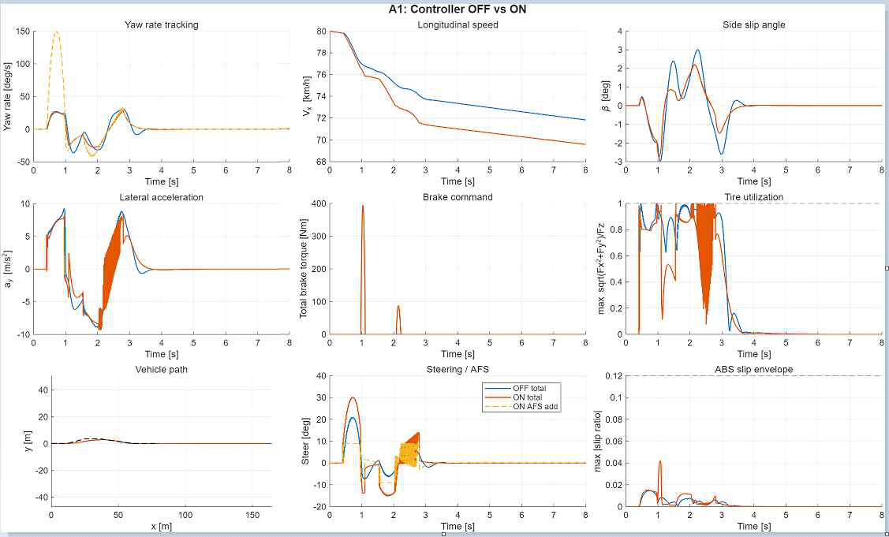
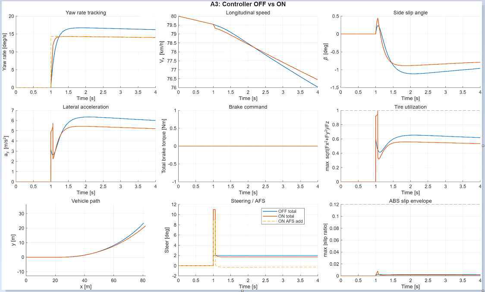
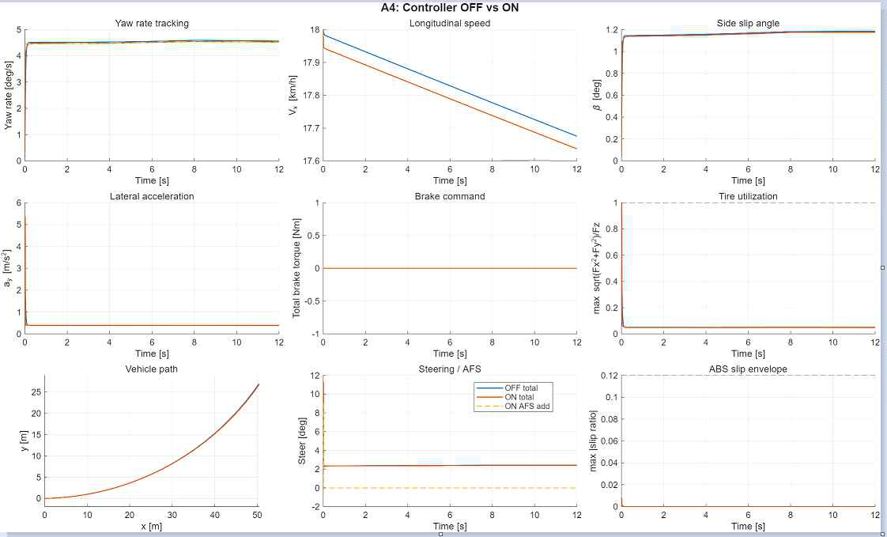
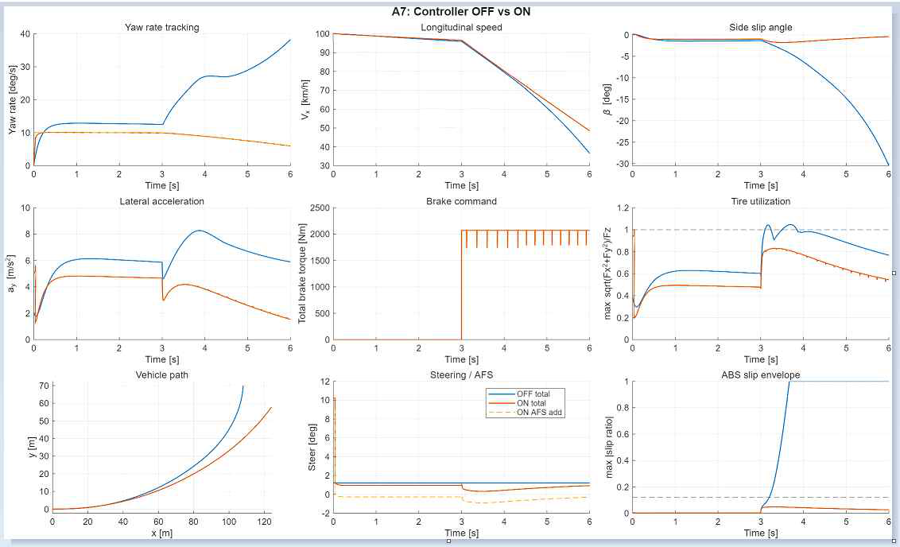
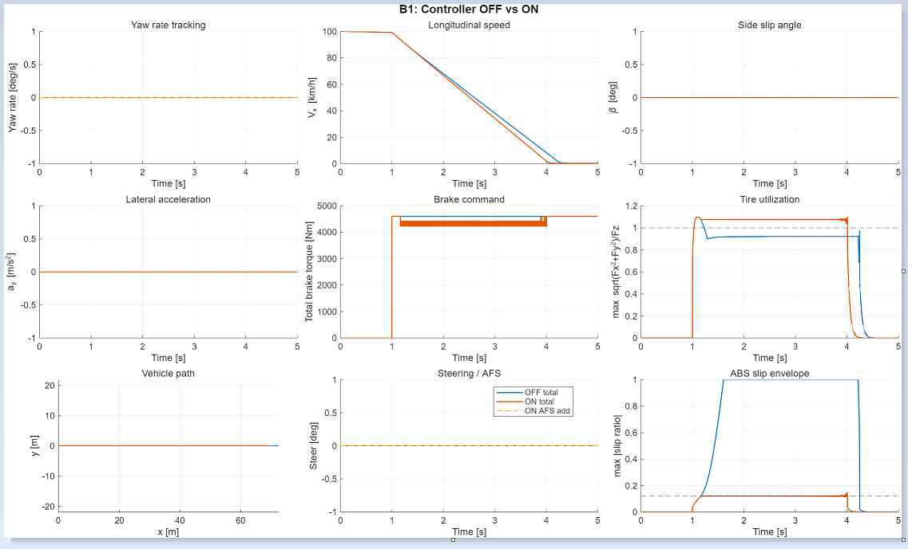
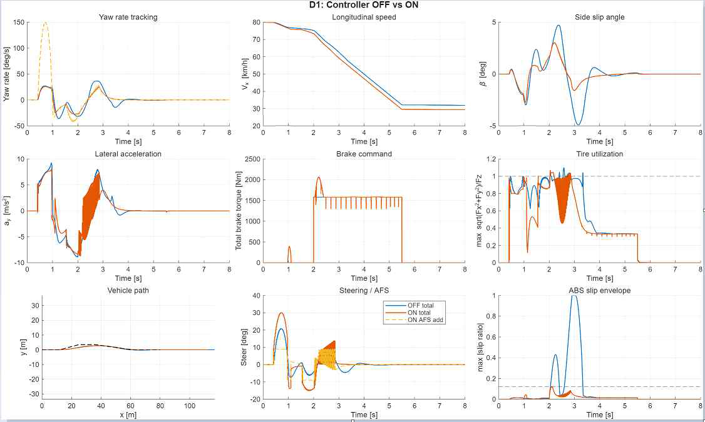

# [202220007-이정민] ICC 제어기 설계 보고서

**과목**: 자동제어 — 2026 봄  
**제출일**: 2026-06-23  
**팀**: 개인  
**자동채점 결과**: Quantitative 58.57 / 70.00, Deductions -0, Auto-graded total 58.57 / 70.00

---

## 1. 설계 개요

본 과제의 목표는 Integrated Chassis Control, 즉 통합 섀시 제어기를 설계하여 고속 차선 변경, step steer, 정상상태 원선회, 선회 중 제동, 직선 급제동, 제동이 포함된 차선 변경 상황에서 차량 안정성과 추종 성능을 개선하는 것이다. 차량은 횡방향, 종방향, 수직방향 운동이 서로 독립적이지 않기 때문에 단일 제어기만으로는 모든 주행 상황에서 안정적인 성능을 얻기 어렵다. 예를 들어 고속 차선 변경에서는 조향 입력으로 인해 횡가속도와 yaw rate가 증가하고, 선회 중 제동 상황에서는 타이어 마찰력이 횡방향 힘과 종방향 제동력에 동시에 사용된다.

본 설계에서는 AFS, ESC, ABS, CDC를 함께 사용하는 통합 제어 구조를 구성하였다. 핵심 제어기법은 PID 기반 yaw rate tracking, rule-based ESC beta limiter, PI 기반 종방향 속도 제어, slip ratio 기반 ABS, Skyhook 기반 CDC, 그리고 rule-based actuator allocation이다. PID와 PI 제어기는 자동제어 강의에서 다루는 대표적인 feedback 제어기이며, 모델이 완전히 정확하지 않아도 오차 기반으로 제어 입력을 구성할 수 있다는 장점이 있다. LQR이나 MPC와 같은 최적제어 기법도 고려할 수 있으나, 본 과제의 최종 검증 plant는 14DOF 모델이고 타이어 포화, 제동 포화, 하중 이동, ABS slip 등 비선형성이 크기 때문에 단순 bicycle model 기반의 최적제어를 그대로 적용하면 모델 불일치 문제가 발생할 수 있다. 따라서 구현과 해석이 명확하고 시뮬레이션 기반 반복 튜닝이 가능한 PID/PI + rule-based 제어 구조를 선택하였다.

각 제어기의 역할은 다음과 같다.

- **ctrl_lateral**: PID 기반 AFS로 yaw rate를 추종하고, rule-based ESC로 side slip angle beta를 제한한다.
- **ctrl_longitudinal**: PI 기반 속도 추종과 slip ratio 기반 ABS 제어를 수행한다.
- **ctrl_vertical**: Skyhook 기반 CDC를 이용하여 각 바퀴의 감쇠계수를 조절한다.
- **ctrl_coordinator**: AFS 조향각, ESC yaw moment, 종방향 제동력, CDC 감쇠계수를 실제 조향각, 4륜 브레이크 토크, 4륜 감쇠계수로 분배한다.

최종 검증은 14DOF 차량 모델에서 수행하였고, 평가 시나리오는 A1, A3, A4, A7, B1, D1이다. 전체적으로 A3 step steer, A7 brake-in-turn, B1 straight braking에서 뚜렷한 개선을 얻었으며, A1과 D1에서는 side slip과 LTR은 개선되었지만 lateral deviation은 증가하는 trade-off가 나타났다. 이는 본 설계가 경로 추종보다 차량 안정성 확보를 우선하도록 구성되었기 때문이다.

---

## 2. 수학적 모델링

### 2.1 사용한 plant 단순화

최종 시뮬레이션은 14DOF plant에서 수행하였다. 14DOF 모델은 차량의 평면 운동뿐만 아니라 롤, 피치, 수직 운동, 각 바퀴의 회전 동역학까지 포함하므로 실제 차량 거동을 더 자세히 반영할 수 있다. 그러나 제어기 설계 단계에서 14DOF 전체 모델을 직접 사용하면 상태 수가 많고 비선형성이 강해 제어기 설계와 gain 튜닝이 매우 복잡해진다.

따라서 횡방향 제어기 설계에는 2DOF bicycle model을 사용하였다. Bicycle model은 좌우 바퀴를 하나의 전륜과 하나의 후륜으로 등가화하고, 차량의 횡방향 속도와 yaw rate를 주요 상태로 다룬다. 이 모델은 AFS에 의한 조향 입력과 yaw rate 응답, side slip angle의 관계를 직관적으로 분석할 수 있으므로 yaw rate tracking 제어기 설계에 적합하다.

종방향 제어기 설계에서는 차량의 종방향 운동을 단순 질량 모델로 보았다. 즉 총 종방향 힘이 차량 속도 변화에 영향을 주며, 제동 중에는 wheel slip ratio를 이용해 ABS 제어를 수행하였다. 수직방향 제어기 설계에서는 각 바퀴별 quarter-car model을 이용해 Skyhook CDC 개념을 적용하였다.

본 설계에서 사용한 모델 구조는 다음과 같다.

- 검증 plant: 14DOF vehicle model
- 횡방향 제어 설계 모델: 2DOF bicycle model
- 종방향 제어 설계 모델: longitudinal mass model + wheel slip model
- 수직방향 제어 설계 모델: quarter-car suspension model

### 2.2 Bicycle model의 운동 방정식

Bicycle model에서 차량의 주요 변수는 종방향 속도 vx, 횡방향 속도 vy, yaw rate r이다. 횡방향 힘 평형과 yaw moment 평형은 다음과 같이 쓸 수 있다.

$$m(\dot{v_y}+v_x r)=F_{yf}+F_{yr}$$

$$I_z\dot{r}=l_fF_{yf}-l_rF_{yr}+M_z$$

여기서 m은 차량 질량, Iz는 yaw 관성 모멘트, lf는 무게중심에서 전륜까지의 거리, lr은 무게중심에서 후륜까지의 거리이다. Fyf와 Fyr은 각각 전륜 및 후륜 횡력이고, Mz는 ESC에 의해 생성되는 추가 yaw moment이다.

작은 slip angle 영역에서는 타이어 횡력을 cornering stiffness로 선형 근사할 수 있다.

$$F_{yf}=C_f\alpha_f$$

$$F_{yr}=C_r\alpha_r$$

전륜과 후륜의 slip angle은 다음과 같이 근사한다.

$$\alpha_f=\delta-\beta-\frac{l_f r}{v_x}$$

$$\alpha_r=-\beta+\frac{l_r r}{v_x}$$

side slip angle beta는 차량의 진행 방향과 차량 몸체가 향하는 방향의 차이를 의미하며, 작은 각도에서는 다음과 같이 근사한다.

$$\beta \approx \frac{v_y}{v_x}$$

이 식들을 이용하면 조향각 delta가 전륜 횡력을 만들고, 이 횡력이 차량의 yaw rate와 side slip angle을 변화시킨다는 것을 알 수 있다. 또한 ESC yaw moment Mz는 조향각과 별도로 yaw dynamics에 직접 작용하므로, 차량이 과도하게 회전하거나 미끄러질 때 안정화 입력으로 사용할 수 있다.

### 2.3 State-space 표현

제어기 설계를 위해 bicycle model을 state-space 형태로 정리하였다.

$$\dot{x}=Ax+Bu$$

$$y=Cx+Du$$

상태 변수는 side slip angle beta와 yaw rate r로 두었다.

$$x=[\beta,\ r]^T$$

입력은 AFS 조향각 delta와 ESC yaw moment Mz로 볼 수 있다.

$$u=[\delta,\ M_z]^T$$

이를 beta와 r에 대해 풀어 쓰면 다음과 같다. GitHub Markdown에서 깨지지 않도록 각 미분방정식은 한 줄짜리 display 수식으로 작성하였다.

$$\dot{\beta}=-\frac{C_f+C_r}{m v_x}\beta+\left(\frac{l_rC_r-l_fC_f}{m v_x^2}-1\right)r+\frac{C_f}{m v_x}\delta$$

$$\dot{r}=\frac{l_rC_r-l_fC_f}{I_z}\beta-\frac{l_f^2C_f+l_r^2C_r}{I_z v_x}r+\frac{l_fC_f}{I_z}\delta+\frac{1}{I_z}M_z$$

이 모델에서 확인할 수 있는 핵심은 다음과 같다. 첫째, 조향각 delta는 yaw rate를 증가시키는 주된 입력이다. 둘째, 차량 속도 vx가 증가하면 같은 조향각에 대해서도 차량 응답이 더 민감해지고 side slip angle이 커질 가능성이 증가한다. 셋째, ESC yaw moment Mz는 yaw rate 방정식에 직접 들어가므로 차량 자세 안정화에 효과적인 입력이다.

### 2.4 목표 yaw rate 모델

운전자가 조향각을 입력했을 때 차량이 이상적으로 따라야 할 yaw rate는 정상상태 bicycle model을 이용하여 계산할 수 있다.

$$r_{ref}=\frac{v_x}{L+K_{us}v_x^2}\delta$$

여기서 L은 축거이며, L = lf + lr이다. Kus는 understeer gradient이다.

$$K_{us}=\frac{m}{L}\left(\frac{l_r}{C_f}-\frac{l_f}{C_r}\right)$$

목표 yaw rate 식은 차량 속도가 증가할수록 조향 응답이 단순히 선형적으로 증가하지 않고, understeer 특성에 의해 제한됨을 보여준다. 고속에서는 같은 조향각이라도 yaw rate가 지나치게 커지면 차량이 불안정해질 수 있으므로, 목표 yaw rate를 차량 동역학 기반으로 계산하는 것이 중요하다.

AFS 제어기의 yaw rate tracking error는 다음과 같이 정의하였다.

$$e_r=r_{ref}-r$$

### 2.5 종방향 모델 및 ABS 모델

종방향 차량 운동은 총 종방향 힘과 차량 질량의 관계로 단순화할 수 있다.

$$m\dot{v_x}=F_{x,total}$$

제동 상황에서는 브레이크 토크가 바퀴 회전 속도를 감소시키고, 타이어와 노면 사이의 slip ratio에 따라 실제 제동력이 결정된다. 단순화하면 바퀴별 종방향 힘은 브레이크 토크와 다음 관계를 가진다.

$$F_{x,i}=\frac{T_{b,i}}{r_w}$$

제동 중 wheel slip ratio는 다음과 같이 정의하였다.

$$\kappa_i=\frac{r_w\omega_i-v_x}{\max(v_x,\epsilon)}$$

제동 상황에서는 rw omega가 vx보다 작아지므로 kappa는 음수 방향으로 증가한다. 바퀴가 완전히 잠기면 slip ratio의 크기가 매우 커지고, 이때 조향 안정성과 제동 안정성이 나빠진다. 따라서 ABS는 slip ratio가 목표값보다 커질 때 브레이크 토크를 줄이는 방식으로 동작한다.

$$|\kappa_i|>\kappa_{target}\quad \Rightarrow \quad T_{b,i}\ \text{감소}$$

본 설계에서는 kappa_target을 약 0.12 근처의 slip envelope로 보았다. 이는 마른 노면에서 바퀴 잠김을 피하면서도 충분한 제동력을 유지하기 위한 값이다.

### 2.6 수직방향 quarter-car model

수직방향 제어에는 quarter-car model을 사용하였다. Quarter-car model은 차체에 해당하는 sprung mass와 바퀴 및 현가장치 일부에 해당하는 unsprung mass로 구성된다.

$$m_s\ddot{z_s}=-k_s(z_s-z_u)-c(\dot{z_s}-\dot{z_u})$$

$$m_u\ddot{z_u}=k_s(z_s-z_u)+c(\dot{z_s}-\dot{z_u})-k_t(z_u-z_r)$$

여기서 ms는 sprung mass, mu는 unsprung mass, zs는 차체 변위, zu는 바퀴 측 변위, zr은 노면 변위이다. ks는 서스펜션 스프링 강성, kt는 타이어 수직 강성, c는 감쇠계수이다. CDC는 이 감쇠계수 c를 고정값으로 두지 않고 주행 상태에 따라 변화시키는 방식이다.

Skyhook on-off 조건은 다음과 같이 적용하였다.

$$\dot{z_s}(\dot{z_s}-\dot{z_u})>0 \quad \Rightarrow \quad c=c_{max}$$

$$\dot{z_s}(\dot{z_s}-\dot{z_u})\leq0 \quad \Rightarrow \quad c=c_{min}$$

### 2.7 Tire utilization과 LTR

타이어 사용률은 타이어가 마찰 한계에 얼마나 가까운지를 나타내는 지표이다.

$$U_i=\frac{\sqrt{F_{x,i}^2+F_{y,i}^2}}{\mu F_{z,i}}$$

U가 1에 가까우면 타이어가 마찰 한계에 가까워졌다는 의미이고, 1을 넘으면 모델상 타이어 포화 영역에 들어간 것으로 해석할 수 있다. 특히 double lane change나 brake-in-turn에서는 횡방향 힘과 종방향 제동력이 동시에 필요하므로 tire utilization이 쉽게 증가한다.

LTR은 Load Transfer Ratio이며 좌우 하중 이동 정도를 나타낸다.

$$LTR=\frac{|F_{z,L}-F_{z,R}|}{F_{z,L}+F_{z,R}}$$

LTR이 커질수록 좌우 하중 이동이 크다는 뜻이며, LTR이 1에 가까워지면 한쪽 바퀴의 수직하중이 거의 0에 가까워지는 상태가 된다. 따라서 A1, A7, D1과 같은 고속 조향 및 제동 상황에서는 LTR을 낮추는 것이 중요하다.

### 2.8 모델링 가정과 한계

본 설계에서 사용한 모델링 가정은 다음과 같다. 첫째, 횡방향 제어기 설계에서는 종방향 속도 vx가 일정하다고 가정하였다. 실제 시나리오에서는 제동 또는 공기저항으로 인해 vx가 변하지만, yaw rate 제어기 설계 단계에서는 일정 속도에서 선형화된 bicycle model을 사용하는 것이 일반적이다.

둘째, 타이어는 작은 slip angle 영역에서 선형 cornering stiffness로 근사하였다. 실제 타이어는 Magic Formula 기반 비선형 모델로 표현되며, 한계 주행에서는 포화가 발생한다. 따라서 설계 모델과 검증 모델 사이에는 차이가 존재한다.

셋째, AFS, ESC, ABS, CDC를 각각 rule-based로 설계한 뒤 Coordinator에서 통합하였다. 이 방식은 구현과 해석이 쉽지만, 모든 actuator를 동시에 최적화하는 WLS나 MPC에 비해서는 전역 최적성에 한계가 있다.

---

## 3. 제어기 설계

### 3.1 ctrl_lateral — AFS + ESC

#### 3.1.1 설계 목표

ctrl_lateral의 설계 목표는 크게 두 가지이다. 첫 번째 목표는 AFS를 이용하여 목표 yaw rate를 빠르게 추종하는 것이다. 특히 A3 step steer 시나리오에서 yaw rate rise time, overshoot, settling time이 중요한 평가 지표이다. 본 설계에서는 settling time 0.8 s 이하, overshoot 10% 이하를 목표로 하였다.

두 번째 목표는 ESC를 이용하여 side slip angle beta가 과도하게 커지는 것을 억제하는 것이다. A1, A7, D1과 같은 고속 조향 또는 제동 중 선회 시나리오에서는 beta가 커지면 spin 또는 조향 상실로 이어질 수 있다. 따라서 beta가 약 3 deg 근처를 넘으면 ESC yaw moment를 발생시켜 차량 자세를 안정화하도록 하였다.

#### 3.1.2 선택 기법

Yaw rate tracking에는 PID 제어기를 사용하였다. 비례항은 yaw rate error를 빠르게 줄이고, 적분항은 정상상태 오차를 줄이며, 미분항은 overshoot과 진동을 줄이는 역할을 한다. AFS PID 제어식은 다음과 같다.

$$\delta_{AFS}=K_pe_r+K_i\int e_r dt+K_d\frac{de_r}{dt}$$

ESC는 rule-based beta limiter로 설계하였다. 즉 side slip angle의 크기가 기준값보다 커질 때만 yaw moment를 발생시킨다.

$$M_z=-K_{\beta}\,\mathrm{sign}(\beta)(|\beta|-\beta_{th})f(v_x)$$

이 구조는 평상시에는 운전자의 조향 의도를 크게 방해하지 않고, 한계 주행 상황에서만 안정화 제어를 수행한다는 장점이 있다.

#### 3.1.3 LQR 대신 PID를 선택한 이유

LQR은 선형 상태공간 모델에 대해 최적 feedback gain을 계산할 수 있는 강력한 방법이다. 그러나 본 과제의 최종 검증 모델은 14DOF이고, 타이어 포화, 제동 포화, 하중 이동, ABS slip 등 비선형 요소가 많다. 만약 단순 bicycle model에 대해 LQR을 설계하면 A3 step steer처럼 선형 모델에 가까운 상황에서는 좋은 결과가 나올 수 있지만, A1이나 D1처럼 tire utilization이 1에 가까운 한계 상황에서는 설계 모델과 실제 plant의 차이가 커질 수 있다.

또한 LQR은 Q, R 가중치 선택에 따라 성능이 크게 달라진다. yaw rate tracking에 큰 가중치를 주면 path tracking은 좋아질 수 있지만 조향 입력이 과도해져 tire utilization과 LTR이 증가할 수 있다. 반대로 안정성에 큰 가중치를 주면 path deviation이 증가할 수 있다. 본 과제에서는 여러 시나리오에 대해 안정적으로 작동하는 것이 중요하므로, 구현과 튜닝이 직관적인 PID + rule-based ESC 구조를 선택하였다.

#### 3.1.4 Gain 계산 과정

횡방향 gain은 A3 step steer의 응답 속도를 기준으로 먼저 설정하였다. 2차 시스템 근사에서 settling time은 다음과 같이 표현된다.

$$T_s\approx\frac{4}{\zeta\omega_n}$$

목표 settling time을 0.8 s 이하로 두고, 감쇠비 zeta를 약 0.7로 가정하면 필요한 자연진동수는 다음과 같다.

$$\omega_n>\frac{4}{0.7\times0.8}\approx7.14\ \mathrm{rad/s}$$

즉 yaw rate loop가 약 7 rad/s 이상의 응답 속도를 갖도록 Kp를 증가시키고, overshoot을 줄이기 위해 Kd를 조정하였다. Ki는 정상상태 오차를 줄이기 위해 포함하였지만, 고속 조향에서 적분항이 과도하게 누적되면 조향 포화와 overshoot을 유발할 수 있으므로 작은 값으로 제한하였다.

최종 횡방향 제어 파라미터는 다음과 같다.

```matlab
CTRL.LAT.Kp = 8;
CTRL.LAT.Ki = 0.1;
CTRL.LAT.Kd = 0.2;
CTRL.LAT.intMax = 0.5;
```

이 값은 A3 step steer에서 빠른 yaw rate tracking을 얻기 위한 값이다. 실제 결과에서 A3 rise time은 0.247 s에서 0.077 s로 감소하였고, settling time은 1.462 s에서 0.526 s로 감소하였다. Overshoot도 2.700%에서 2.076%로 감소하여 목표 조건인 10% 이하를 만족하였다.

### 3.2 ctrl_longitudinal — 속도 제어 + ABS

#### 3.2.1 설계 목표

ctrl_longitudinal의 목표는 종방향 속도 추종과 제동 중 wheel lock 방지이다. 일반적인 주행에서는 목표 속도 vx_ref와 실제 속도 vx의 오차를 줄이도록 총 종방향 힘 Fx_total을 계산한다. 그러나 B1 straight braking과 D1 DLC + braking에서는 단순 속도 추종보다 ABS가 더 중요하다. 제동력이 너무 크면 바퀴가 잠기고 slip ratio가 1에 가까워지며, 이 경우 제동 안정성과 조향 안정성이 모두 악화된다.

#### 3.2.2 선택 기법

속도 제어에는 PI 제어기를 사용하였다. 속도 오차는 다음과 같다.

$$e_v=v_{x,ref}-v_x$$

종방향 힘 명령은 다음과 같이 계산된다.

$$F_{x,total}=K_pe_v+K_i\int e_vdt$$

미분항은 사용하지 않았다. 그 이유는 속도 측정값에 미분항을 적용하면 noise에 민감해질 수 있고, 본 과제에서는 급제동 상황에서 ABS slip 제어가 더 핵심이기 때문이다.

ABS 제어는 slip ratio 기반 rule로 구성하였다. 제동 중이고 slip ratio의 크기가 목표 slip보다 커지면 브레이크 토크를 감소시켜 wheel lock을 방지한다.

```matlab
CTRL.LON.Kp = 1;
CTRL.LON.Ki = 0.05;
CTRL.LON.intMax = 2000;
```

ABS 목표 slip은 약 0.12 근처의 slip envelope를 기준으로 두었다. 이는 마른 노면에서 충분한 제동력을 유지하면서도 바퀴 잠김을 피하기 위한 값이다. 또한 종방향 힘 변화율에는 jerk limit을 고려하였다. 이는 제동력이 너무 급격하게 변하여 차량 거동이 불안정해지는 것을 방지하기 위한 것이다.

#### 3.2.3 결과와 정당화

B1 straight braking 결과에서 absSlipRMS는 Controller OFF 0.7295에서 Controller ON 0.0905로 감소하였다. 이는 약 87.60% 개선이며, 목표 기준인 0.10 이하를 만족한다. 또한 stoppingDistance는 72.299 m에서 69.717 m로 감소하였고, timeToStop도 4.220 s에서 4.004 s로 감소하였다. 따라서 본 ABS 제어는 wheel lock 방지와 제동 성능 개선에 모두 효과가 있었다.

### 3.3 ctrl_vertical — CDC

#### 3.3.1 설계 목표

ctrl_vertical의 목표는 각 바퀴의 damping coefficient를 조절하여 차체 진동과 하중 이동을 완화하는 것이다. 본 과제의 주요 KPI는 yaw rate, side slip, LTR, stopping distance이므로 수직방향 제어기는 직접적인 주 제어기라기보다는 통합 안정성을 보조하는 역할을 한다.

#### 3.3.2 선택 기법

수직방향 제어에는 Skyhook 기반 CDC를 사용하였다. Skyhook 제어는 차체가 절대좌표계의 가상 댐퍼에 연결되어 있다고 가정하고, sprung mass의 수직 속도를 줄이는 방향으로 감쇠계수를 조절한다.

최종 CDC 파라미터는 다음과 같다.

```matlab
CTRL.VER.cMin = 500;
CTRL.VER.cMax = 5000;
CTRL.VER.skyGain = 2500;
```

cMin은 노면 충격 전달을 줄이기 위한 낮은 감쇠 상태이고, cMax는 차체 진동을 빠르게 줄이기 위한 높은 감쇠 상태이다. skyGain은 Skyhook 제어의 기준 gain이다.

### 3.4 ctrl_coordinator — Actuator Allocation

#### 3.4.1 설계 목표

Coordinator의 목표는 상위 제어기에서 계산된 명령을 실제 actuator 명령으로 변환하는 것이다. 입력은 AFS 보조 조향각, ESC yaw moment, 총 종방향 힘, 4륜 damping coefficient이고, 출력은 조향각, 4륜 브레이크 토크, 4륜 감쇠계수이다.

#### 3.4.2 조향각 제한

AFS 보조 조향각은 actuator 조향각 제한을 적용하여 전달한다. 최종 파라미터에서 조향각 제한은 다음과 같다.

```matlab
LIM.MAX_STEER_ANGLE = deg2rad(300/15);
LIM.MAX_STEER_RATE  = deg2rad(1000/15);
```

#### 3.4.3 종방향 제동 분배

총 제동력은 전후 60:40 비율을 기준으로 분배하였다. 각 바퀴의 브레이크 토크는 타이어 반경을 곱하여 계산하였다.

$$T_{b,i}=F_{x,i}r_w$$

#### 3.4.4 ESC yaw moment의 brake differential 분배

ESC yaw moment는 좌우 브레이크 토크 차이를 이용하여 구현하였다. 좌우 바퀴에 서로 다른 제동력을 가하면 차량 중심에 yaw moment가 발생한다. 따라서 필요한 좌우 제동력 차이는 다음과 같이 표현할 수 있다.

$$M_z\approx\Delta F_x\frac{t}{2}$$

$$\Delta F_x\approx\frac{2M_z}{t}$$

브레이크 토크는 물리적 한계를 넘지 않도록 제한한다.

```matlab
LIM.MAX_BRAKE_TRQ = 3000;
```

#### 3.4.5 Coordinator의 한계

본 설계의 Coordinator는 rule-based allocation이다. 즉 yaw moment, 종방향 제동력, damping 명령을 물리적 제한 안에서 분배한다. 이 방식은 구현이 쉽고 해석이 명확하지만, 각 타이어의 마찰원을 직접 계산하여 최적화하지는 않는다. 따라서 A1과 D1처럼 조향과 제동이 동시에 발생하는 상황에서는 tire utilization과 lateral deviation 사이에 trade-off가 나타날 수 있다. 향후에는 WLS 기반 allocation을 사용하여 tire utilization을 직접 제한하는 방향으로 개선할 수 있다.

---

## 4. 시뮬레이션 결과

### 4.1 P1 시나리오 benchmark — 베이스라인 vs 본인 설계

최종 시뮬레이션은 공식 benchmark 스크립트인 다음 명령을 이용하여 수행하였다.

```matlab
run('scripts/run_icc_benchmark.m')
```

또한 자동채점 점수는 다음 명령으로 확인하였다.

```matlab
run('scripts/grade.m')
```

`run_icc_benchmark.m`는 A1, A3, A4, A7, B1, D1 시나리오에 대해 Controller OFF와 Controller ON을 비교하는 용도로 사용하였다. 주요 KPI 결과는 다음과 같다.

| 시나리오 | KPI | OFF | ON (본인) | 변화율 | 판단 |
|---|---:|---:|---:|---:|---|
| A1 DLC | sideSlipMax [deg] | 3.008 | 2.762 | 8.20% | 개선 |
| A1 DLC | LTR_max | 0.868 | 0.638 | 26.58% | 개선 |
| A1 DLC | tireUtilizationMax | 0.999 | 1.000 | 거의 동일 | 유지 |
| A1 DLC | lateralDevMax [m] | 1.825 | 1.931 | 악화 | 한계 |
| A3 Step steer | yawRateRiseTime [s] | 0.247 | 0.077 | 68.83% | 개선 |
| A3 Step steer | yawRateOvershoot [%] | 2.700 | 2.076 | 23.10% | 개선 |
| A3 Step steer | yawRateSettling [s] | 1.462 | 0.526 | 64.02% | 개선 |
| A3 Step steer | sideSlipMax [deg] | 1.114 | 0.886 | 20.41% | 개선 |
| A4 Steady-state | sideSlipMax [deg] | 1.184 | 1.176 | 소폭 개선 | 개선 |
| A4 Steady-state | understeerGradient | 0.000749 | 0.000753 | 소폭 개선 | 개선 |
| A4 Steady-state | LTR_max | 0.0258 | 0.0255 | 소폭 개선 | 개선 |
| A7 Brake-in-turn | sideSlipMax [deg] | 30.478 | 1.764 | 94.21% | 개선 |
| A7 Brake-in-turn | LTR_max | 0.681 | 0.317 | 53.44% | 개선 |
| A7 Brake-in-turn | tireUtilizationMax | 1.047 | 0.999 | 4.54% | 개선 |
| A7 Brake-in-turn | yawDevDuringBrake | 117.906 | 54.180 | 54.05% | 개선 |
| B1 Straight braking | stoppingDistance [m] | 72.299 | 69.717 | 3.57% | 개선 |
| B1 Straight braking | MFDD [m/s^2] | 8.320 | 9.014 | 8.34% | 개선 |
| B1 Straight braking | timeToStop [s] | 4.220 | 4.004 | 5.12% | 개선 |
| B1 Straight braking | absSlipRMS | 0.7295 | 0.0905 | 87.60% | 개선 |
| D1 DLC + braking | yawRateOvershoot | 8.569e6 | 2.085e5 | 97.57% | 개선 |
| D1 DLC + braking | sideSlipMax [deg] | 4.906 | 3.020 | 38.45% | 개선 |
| D1 DLC + braking | LTR_max | 0.868 | 0.636 | 26.82% | 개선 |
| D1 DLC + braking | tireUtilizationMax | 1.099 | 1.071 | 2.56% | 개선 |
| D1 DLC + braking | lateralDevMax [m] | 1.825 | 1.931 | 악화 | 한계 |

전체 결과를 보면 A3, A7, B1에서 성능 개선이 매우 뚜렷하다. A3에서는 yaw rate tracking 성능이 크게 개선되었고, A7에서는 선회 중 제동 상황에서 side slip과 LTR이 크게 감소하였다. B1에서는 ABS slip RMS가 크게 감소하여 wheel lock 방지 효과가 확인되었다. 반면 A1과 D1에서는 side slip과 LTR은 개선되었지만 lateral deviation은 악화되었다. 이는 본 제어기가 경로 추종보다 차량 안정성을 우선하도록 설계되었기 때문이다.

### 4.2 자동채점 결과

자동채점은 `run('scripts/grade.m')`로 수행하였다. 출력된 채점 결과는 다음과 같다.

| sid | KPI | value | target | score | max |
|---|---:|---:|---:|---:|---:|
| A3 | yawRateOvershoot | 2.0759 | 10.0000 | 4.00 | 4 |
| A3 | yawRateRiseTime | 0.0770 | 0.3000 | 4.00 | 4 |
| A3 | yawRateSettling | 0.5260 | 0.8000 | 4.00 | 4 |
| A1 | sideSlipMax | 2.7616 | 3.0000 | 6.00 | 6 |
| A1 | LTR_max | 0.6377 | 0.6000 | 4.69 | 5 |
| A1 | lateralDevMax | 1.9314 | 0.7000 | 0.00 | 4 |
| A4 | understeerGradient | 0.0008 | 0.0030 | 5.00 | 5 |
| A4 | sideSlipMax | 1.1761 | 2.0000 | 5.00 | 5 |
| A7 | sideSlipMax | 1.7639 | 5.0000 | 8.00 | 8 |
| A7 | LTR_max | 0.3170 | 0.7000 | 7.00 | 7 |
| B1 | stoppingDistance | 69.7169 | 40.0000 | 0.00 | 5 |
| B1 | absSlipRMS | 0.0905 | 0.1000 | 5.00 | 5 |
| D1 | sideSlipMax | 3.0196 | 4.0000 | 4.00 | 4 |
| D1 | LTR_max | 0.6356 | 0.6000 | 1.88 | 2 |
| D1 | lateralDevMax | 1.9314 | 1.0000 | 0.00 | 2 |

자동채점 요약은 다음과 같다.

```text
Quantitative:  58.57 / 70.00  (83.7 %)
Deductions:    -0
Manual (TBD):  / 30.00  (보고서 평가 — 채점자가 직접 매김)
Auto-graded total: 58.57 / 70.00 (보고서 평가 추가 시 max 100)
```

따라서 본 설계의 정량 자동채점 결과는 58.57 / 70.00점이다. 감점은 없었으며, 보고서 평가 30점이 추가되면 최종 점수는 100점 만점 기준으로 산정된다.

### 4.3 핵심 plot — A1 DLC

A1은 고속 double lane change 시나리오이며, 조향 입력이 빠르게 변하기 때문에 yaw rate, side slip angle, LTR, tire utilization, lateral deviation이 모두 중요하다.



*Figure 4.1 — A1 ISO 3888 DLC, Controller OFF vs ON 비교 결과.*

A1 결과에서 Controller ON은 sideSlipMax를 3.008 deg에서 2.762 deg로 줄였고, LTR_max를 0.868에서 0.638로 감소시켰다. 이는 AFS와 ESC가 차량 자세 안정화에 효과가 있음을 보여준다. 특히 LTR 감소는 좌우 하중 이동이 줄어들었다는 의미이므로 rollover 안정성 측면에서 긍정적이다.

그러나 lateralDevMax는 1.825 m에서 1.931 m로 증가하였다. 이는 제어기가 경로를 무리하게 추종하기보다 side slip과 LTR을 줄이는 방향으로 작동했기 때문이다. 고속 DLC 상황에서 path tracking을 강하게 하려면 조향 입력이 커지고, 그 결과 tire utilization과 LTR이 증가할 수 있다. 따라서 본 설계는 경로 오차를 일부 허용하는 대신 차량 안정성을 확보하는 방향으로 동작하였다.

### 4.4 핵심 plot — A3 Step Steer

A3는 횡방향 제어기의 yaw rate tracking 성능을 가장 직접적으로 확인할 수 있는 시나리오이다.



*Figure 4.2 — A3 step steer, yaw rate tracking 성능 비교.*

Controller ON에서는 yaw rate가 목표값에 빠르게 도달하고 overshoot이 작게 유지되었다. Rise time은 0.247 s에서 0.077 s로 감소하였고, settling time은 1.462 s에서 0.526 s로 감소하였다. Overshoot도 2.700%에서 2.076%로 감소하였다. 이 결과는 PID 기반 AFS가 yaw rate tracking 성능을 효과적으로 개선했음을 보여준다.

### 4.5 A4 Steady-state Circular Driving

A4는 정상상태 원선회 시나리오로, 차량의 understeer 특성과 정상상태 side slip, yaw rate, tire utilization을 확인하는 시나리오이다.



*Figure 4.3 — A4 steady-state circular driving, Controller OFF vs ON 비교 결과.*

A4 결과를 보면 Controller OFF와 ON의 차량 경로와 yaw rate 응답이 거의 비슷하게 나타난다. 이는 A4 시나리오가 비교적 완만한 정상상태 원선회이고, Controller OFF 상태에서도 side slip angle과 LTR이 크지 않았기 때문이다. Controller ON에서는 sideSlipMax가 1.184 deg에서 1.176 deg로 아주 작게 감소하였고, LTR_max도 0.0258에서 0.0255로 소폭 감소하였다. UndersteerGradient도 0.000749에서 0.000753으로 증가하여 understeer 성향이 약간 증가하였다.

A4에서 제어 효과가 제한적으로 나타난 이유는 본 제어기의 주 목적이 정상상태 understeer gradient 조절이 아니라 yaw rate tracking과 side slip 안정화이기 때문이다. 따라서 A4 결과는 제어기가 실패했다기보다는, 본 설계 구조가 정상상태 understeer 특성을 적극적으로 바꾸는 제어기가 아니기 때문에 개선 폭이 제한적이었다고 해석하는 것이 타당하다.

### 4.6 한 시나리오 deep dive — A7 Brake-in-Turn

A7은 본 설계에서 가장 큰 안정성 개선이 나타난 시나리오이다. A7은 선회 중 제동이 들어가는 상황으로, 타이어 마찰력이 횡방향 힘과 종방향 제동력에 동시에 사용된다. 또한 제동으로 인해 전륜 하중은 증가하고 후륜 하중은 감소하므로, 차량이 yaw 불안정 상태에 빠지기 쉽다.



*Figure 4.4 — A7 brake-in-turn, Controller OFF vs ON 비교 결과.*

Controller OFF에서는 제동 이후 yaw rate와 side slip angle이 급격히 증가하였다. sideSlipMax는 30.478 deg까지 증가하였고, 이는 차량이 거의 spin 상태에 가까워졌다는 것을 의미한다. 반면 Controller ON에서는 sideSlipMax가 1.764 deg로 감소하였다. 개선율은 94.21%이다.

또한 LTR_max는 0.681에서 0.317로 감소하였고, tireUtilizationMax도 1.047에서 0.999로 감소하였다. 이는 ESC yaw moment, ABS modulation, brake allocation이 함께 작동하여 제동 중 선회 안정성을 크게 개선했음을 의미한다. 따라서 A7은 통합 섀시 제어의 필요성을 가장 잘 보여주는 시나리오이다.

### 4.7 B1 Straight Braking 결과

B1은 직선 급제동 시나리오이므로 횡방향 운동은 거의 발생하지 않는다. 따라서 주요 평가 지표는 stopping distance, MFDD, timeToStop, absSlipRMS이다.



*Figure 4.5 — B1 straight braking, ABS slip envelope 비교.*

Controller OFF에서는 ABS slip envelope가 1에 가까워지는 구간이 나타났다. 이는 wheel lock에 가까운 상태를 의미한다. 반면 Controller ON에서는 slip이 목표 영역 근처로 제한되었고, absSlipRMS는 0.7295에서 0.0905로 감소하였다. 이는 87.60% 개선이다.

Stopping distance도 72.299 m에서 69.717 m로 줄었고, timeToStop도 4.220 s에서 4.004 s로 줄었다. 다만 자동채점 기준에서 stoppingDistance의 목표값은 40.0 m로 설정되어 있어 해당 항목에서는 0점을 받았다. 즉 ABS는 wheel lock 방지에는 성공했지만, 목표 제동거리 기준을 만족할 만큼 강한 감속 성능을 확보하지는 못하였다.

### 4.8 D1 통합 시나리오 결과

D1은 A1 double lane change에 제동이 추가된 복합 시나리오이다. 따라서 횡방향 안정성, 경로 추종, 제동 안정성, tire utilization이 모두 중요하다.



*Figure 4.6 — D1 double lane change + braking, Controller OFF vs ON 비교 결과.*

Controller ON에서는 yawRateOvershoot이 8.569e6에서 2.085e5로 크게 감소하였고, sideSlipMax는 4.906 deg에서 3.020 deg로 감소하였다. LTR_max도 0.868에서 0.636으로 감소하였다. 이는 AFS, ESC, ABS가 복합적으로 작동하여 차량 안정성을 개선했음을 의미한다.

그러나 lateralDevMax는 1.825 m에서 1.931 m로 증가하였다. A1과 마찬가지로 경로 추종보다 안정성 확보를 우선했기 때문에 path deviation이 증가한 것으로 해석할 수 있다. 특히 D1에서는 제동까지 동시에 발생하므로 타이어 마찰 여유가 부족하고, 경로를 강하게 추종하려는 조향 입력은 tire utilization을 더 악화시킬 수 있다. 따라서 D1 결과는 본 제어기의 장점과 한계를 동시에 보여준다.

---

## 5. 분석 및 한계

### 5.1 가장 성공적이었던 시나리오

가장 성공적이었던 시나리오는 A7 brake-in-turn과 B1 straight braking이다. A7에서는 sideSlipMax가 30.478 deg에서 1.764 deg로 감소하여 94.21% 개선되었다. LTR_max도 0.681에서 0.317로 감소하였다. 이는 제동 중 선회 상황에서 차량이 spin으로 진행되는 것을 ESC와 ABS가 효과적으로 억제했음을 의미한다.

B1에서는 absSlipRMS가 0.7295에서 0.0905로 크게 감소하였다. 자동채점 기준에서도 absSlipRMS 항목은 5점 만점 중 5점을 얻었다. 즉 본 ABS 제어는 바퀴 잠김 방지 측면에서는 명확한 효과가 있었다.

A3 step steer도 성공적인 결과를 보였다. yawRateOvershoot, yawRateRiseTime, yawRateSettling 세 항목 모두 만점을 얻었고, 이는 PID 기반 AFS가 yaw rate tracking 성능을 효과적으로 개선했음을 보여준다.

### 5.2 가장 부족했던 시나리오

가장 부족했던 부분은 A1과 D1의 lateralDevMax, 그리고 B1의 stoppingDistance이다. A1 lateralDevMax는 1.9314 m로 목표 0.7 m를 만족하지 못했고, D1 lateralDevMax도 1.9314 m로 목표 1.0 m를 만족하지 못하였다. 이는 제어기가 경로 추종보다 side slip과 LTR 감소를 우선했기 때문이다.

B1 stoppingDistance는 69.7169 m로 목표 40.0 m를 만족하지 못해 0점을 받았다. ABS slip RMS는 목표를 만족했지만, 제동거리를 줄이기 위해서는 slip ratio를 목표 영역 근처에 유지하면서도 평균 제동력을 더 크게 만드는 제어가 필요하다. 즉 ABS release가 너무 보수적이면 wheel lock은 줄지만 제동거리가 충분히 짧아지지 않는다.

A4는 sideSlipMax와 understeerGradient 항목에서 만점을 받았지만, 실제 benchmark에서는 OFF와 ON의 차이가 크지 않았다. 이는 정상상태 원선회에서 차량이 이미 안정적인 영역에 있었고, 본 제어기가 understeerGradient 자체를 직접 목표로 하는 구조가 아니었기 때문이다.

### 5.3 Trade-off 분석

본 설계에서 가장 큰 trade-off는 경로 추종과 안정성 사이에서 나타났다. A1과 D1에서 side slip과 LTR을 낮추려면 조향과 브레이크 yaw moment를 안정화 방향으로 사용해야 한다. 그러나 이 경우 운전자가 의도한 경로를 강하게 따라가는 능력은 감소할 수 있다. 반대로 lateral deviation을 줄이기 위해 yaw rate reference를 더 강하게 추종하면 조향 입력이 커지고, tire utilization과 LTR이 증가할 수 있다.

따라서 본 설계는 경로 오차를 일부 허용하더라도 차량의 자세 안정성 확보를 우선하도록 튜닝하였다. 이는 A7과 D1에서 sideSlipMax가 크게 감소한 결과로 확인된다. 다만 자동채점에서는 lateralDevMax도 중요한 항목이므로, 추후에는 경로 추종 성능을 개선하는 별도 feed-forward 또는 preview 기반 보정이 필요하다.

### 5.4 향후 개선 방향

향후 개선 방향은 다음과 같다.

첫째, A1과 D1의 lateral deviation을 줄이기 위해 yaw rate reference에 path preview 정보를 포함할 수 있다. 현재는 주로 yaw rate error와 side slip 안정화에 초점을 두었기 때문에 경로 오차를 직접 줄이는 항이 부족하다.

둘째, B1 stopping distance를 줄이기 위해 ABS 목표 slip을 고정값으로 두지 않고 노면 마찰과 차량 속도에 따라 adaptive하게 조정할 수 있다. 또한 브레이크 release와 reapply 로직을 더 세밀하게 조정하면 wheel lock을 방지하면서 평균 제동력을 높일 수 있다.

셋째, Coordinator를 rule-based 방식에서 WLS 기반 actuator allocation으로 확장할 수 있다. WLS를 사용하면 타이어 마찰원 제약, 브레이크 토크 제한, 조향각 제한을 동시에 고려하여 각 actuator 명령을 분배할 수 있으므로 tire utilization을 더 효율적으로 관리할 수 있다.

넷째, A4 정상상태 원선회 성능을 더 개선하려면 understeerGradient를 직접 목표로 하는 정상상태 보정항을 추가할 수 있다. 예를 들어 횡가속도와 원선회 반경을 이용해 목표 yaw rate를 보정하면 정상상태 선회 특성을 더 적극적으로 바꿀 수 있다.

---

## 6. 참고문헌

[1] ISO 3888-1:2018 — Passenger cars — Test track for a severe lane-change manoeuvre.  
[2] ISO 4138:2021 — Passenger cars — Steady-state circular driving behaviour.  
[3] R. Rajamani, *Vehicle Dynamics and Control*, 2nd ed., Springer, 2012.  
[4] J. Y. Wong, *Theory of Ground Vehicles*, 4th ed., Wiley, 2008.  
[5] K. J. Åström and R. M. Murray, *Feedback Systems: An Introduction for Scientists and Engineers*, Princeton University Press, 2008.

---

## 부록 A - 사용한 AI 도구

본 보고서 작성 과정에서 ChatGPT를 보조 도구로 사용하였다. 사용 목적은 다음과 같다.

1. Bicycle model, yaw rate reference, side slip angle, ABS slip ratio, Skyhook control 등 이론식 정리 보조
2. PID/PI gain tuning 방향에 대한 초기 아이디어 정리
3. 시뮬레이션 결과 표의 문장화 및 보고서 문체 정리
4. A1, A3, A4, A7, B1, D1 KPI 결과 해석 보조

단, 최종 제어기 파라미터와 성능 판단은 MATLAB 시뮬레이션 결과를 기준으로 직접 확인하였다. ChatGPT가 제안한 내용은 그대로 사용하지 않고, 과제 코드와 시뮬레이션 결과에 맞게 수정하였다.

예시:

- 초기에는 yaw rate tracking 성능 향상을 위해 Kp를 증가시키는 방향을 검토하였다.
- 시뮬레이션 결과 A3에서 settling time이 충분히 줄어드는 것을 확인한 뒤 최종적으로 `CTRL.LAT.Kp = 8`, `CTRL.LAT.Kd = 0.2`를 사용하였다.
- A1과 D1에서 path deviation이 악화되는 trade-off를 확인하고, 보고서에서는 이를 한계점으로 명시하였다.

---

## 부록 B - 본인 sim_params.m 변경사항

최종적으로 사용한 주요 `sim_params.m` 설정은 다음과 같다.

```matlab
%% 시뮬레이션 설정
SIM.dt       = 0.001;
SIM.t_end    = 30;
SIM.out_rate = 100;
SIM.solver   = 'ode45';

%% Plant Model 선택
SIM.plantModel = '14dof';

%% 횡방향 제어기 파라미터
CTRL.LAT.Kp     = 8;
CTRL.LAT.Ki     = 0.1;
CTRL.LAT.Kd     = 0.2;
CTRL.LAT.intMax = 0.5;

%% 종방향 제어기 파라미터
CTRL.LON.Kp     = 1;
CTRL.LON.Ki     = 0.05;
CTRL.LON.intMax = 2000;

%% 수직방향 제어기 파라미터
CTRL.VER.cMin    = 500;
CTRL.VER.cMax    = 5000;
CTRL.VER.skyGain = 2500;

%% Coordinator 가중치
CTRL.COORD.wLat = 1.0;
CTRL.COORD.wLon = 1.0;
CTRL.COORD.wVer = 0.5;
CTRL.COORD.wEff = 0.1;

%% 액추에이터 한계
LIM.MAX_STEER_ANGLE = deg2rad(300/15);
LIM.MAX_STEER_RATE  = deg2rad(1000/15);
LIM.MAX_BRAKE_TRQ   = 3000;
LIM.MAX_AX          = 100.0;
LIM.MAX_AY          = 10.0;
LIM.MAX_JERK        = 50.0;
LIM.MAX_YAW_RATE    = deg2rad(60);
LIM.MAX_SLIP_ANGLE  = deg2rad(12);
```

기본 제공 파라미터와 비교했을 때 주요 변경점은 다음과 같다.

```matlab
% 변경 전 예시
% CTRL.LAT.Kp = 1.0;
% CTRL.LAT.Kd = 0.05;
% LIM.MAX_STEER_ANGLE = deg2rad(540/15);
% SIM.plantModel = 'bicycle';

% 변경 후
CTRL.LAT.Kp = 8;
CTRL.LAT.Kd = 0.2;
CTRL.LAT.intMax = 0.5;
CTRL.LON.Kp = 1;
LIM.MAX_STEER_ANGLE = deg2rad(300/15);
LIM.MAX_STEER_RATE = deg2rad(1000/15);
SIM.plantModel = '14dof';
```

횡방향 \(K_p\)와 \(K_d\)를 증가시킨 이유는 A3 step steer에서 yaw rate rise time과 settling time을 개선하기 위해서이다. 다만 조향각이 과도해지는 것을 막기 위해 intMax를 0.5로 제한하였다. 또한 조향각 제한을 `deg2rad(300/15)`로 설정하여 AFS 입력이 과도하게 커지지 않도록 하였다. 최종 plantModel은 실제 평가 조건에 맞추기 위해 14DOF로 설정하였다.


